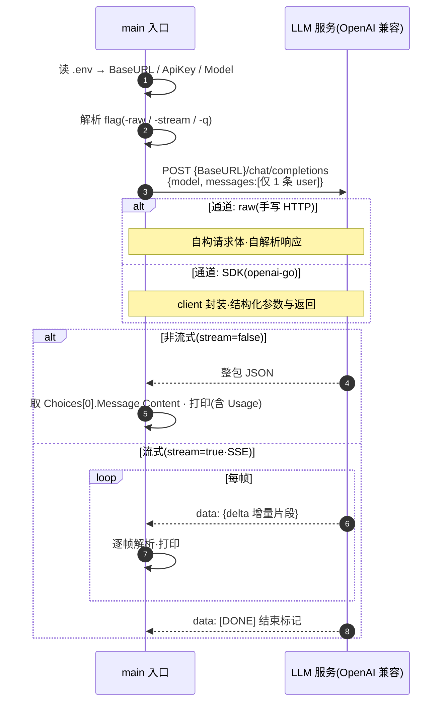

# ch01 · 裸 LLM 调用

> 读完本章你应能回答：调一个 OpenAI 兼容的 LLM 服务，最少需要哪几步？流式和非流式差在哪？

## 这章解决什么问题

写 Agent 之前先搞清最底层的事：**怎么调 LLM**。本章用四种姿势（手写 HTTP / SDK × 非流式 / 流式）各完成一次最小调用，让你看清请求与响应的原始形态。之后所有章节都建立在「SDK + 流式」之上。

## 模块清单

| 模块 | 职责 | 要点 |
|------|------|------|
| 配置加载 | 从 .env 读 BaseURL / ApiKey / Model | 所有章节共用 |
| 请求构造 | 拼 chat/completions 请求体 | 只需 messages + model |
| 调用通道 | 把请求发给服务 | raw：手写 HTTP；SDK：openai-go |
| 响应消费 | 拿到模型的输出 | 非流式整包解析；流式逐帧解析 |

## 一图看懂：时序图（参与者 = 模块，箭头 = 调用，自上而下 = 时间）

raw 与 SDK 只是「main → LLM」的通道不同：raw 要自己逐行识别 `data:` 和 `[DONE]`，SDK 封装成迭代器。

## 关键设计取舍

- **raw 与 SDK 能力等价**，只是抽象层级不同。raw 的价值是让你亲眼看到 SSE 帧长什么样；生产直接用 SDK。
- **刻意最小化**：只发一条 user 消息，没有历史、没有系统提示词、没有工具——这些都是后面章节逐个加上去的积木。
- 输出直接打日志，不做渲染；出错直接退出（教学代码风格）。

## 演进

ch02 在此之上引入 Agent Loop 与工具接口，让模型获得「行动力」。
