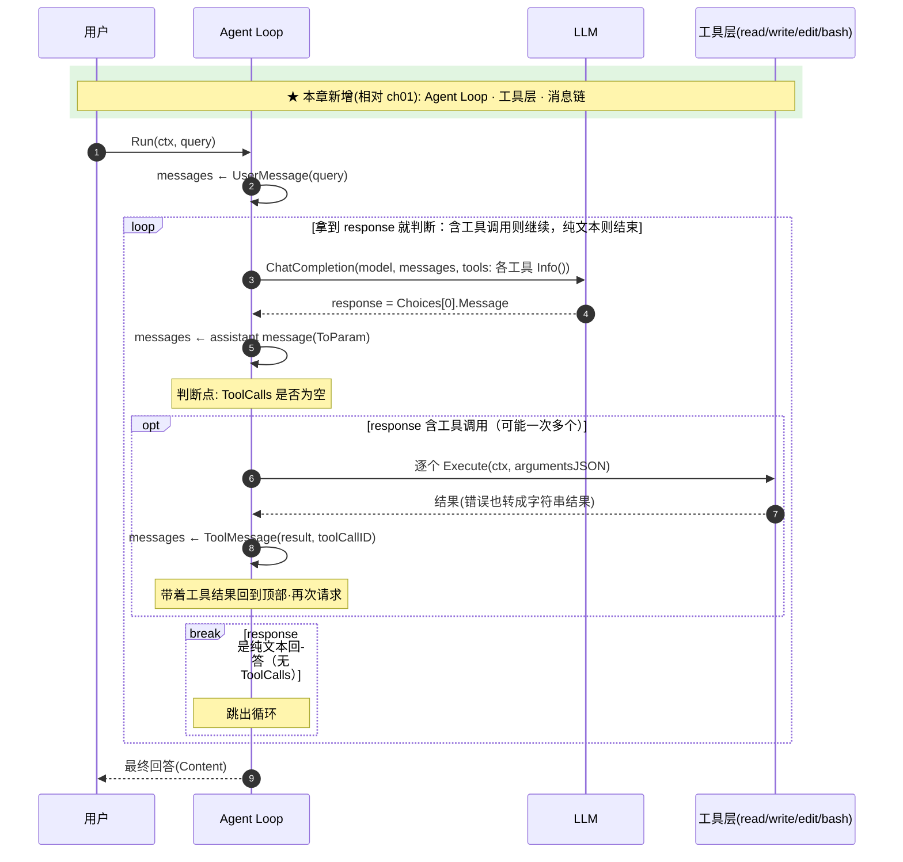

# ch02 · 第一个 Agent

> 读完本章你应能回答：Agent 比裸调用多了什么？工具循环是怎么转起来的？

## 这章解决什么问题

裸调用的模型只能「说话」不能「做事」。本章引入 Agent 的两个核心积木：
- **Agent Loop**：模型说「我要调工具」→ 执行 → 结果喂回去 → 再问模型，直到模型给出最终回答
- **Tool 接口**：所有工具的统一契约，Agent 不关心每个工具内部怎么实现

## 模块清单

| 模块 | 职责 | 对外形态 |
|------|------|---------|
| Agent Loop | 决定何时再调模型、何时结束 | Run(query) → 最终回答 |
| 消息链 | 对话历史的唯一事实源 | 追加 user / assistant / tool 三类消息 |
| 工具层 | 统一契约：名字 + 自描述 + 执行 | read / write / edit / bash 四个实现 |
| 系统提示词 | 定义模型行为准则 | 一段静态文本 |

## 一图看懂：时序图（参与者 = 模块，箭头 = 方法调用，自上而下 = 时间）

核心就这一个循环：**模型自己决定**用不用工具、用哪个、什么时候收工。

## 关键设计取舍

- **工具错误不中断循环**：错误转成字符串结果回传给模型，让模型自己决定重试还是换方法。
- **消息链原地修改**：本轮失败会污染历史（ch03 用副本机制修复）。
- **同步阻塞**：无流式、无取消，跑完才返回——够小但体验差。

## 演进

ch03 把循环改成流式并加上 TUI：边生成边渲染、可随时取消，并把「本轮消息」与「历史」分离。
