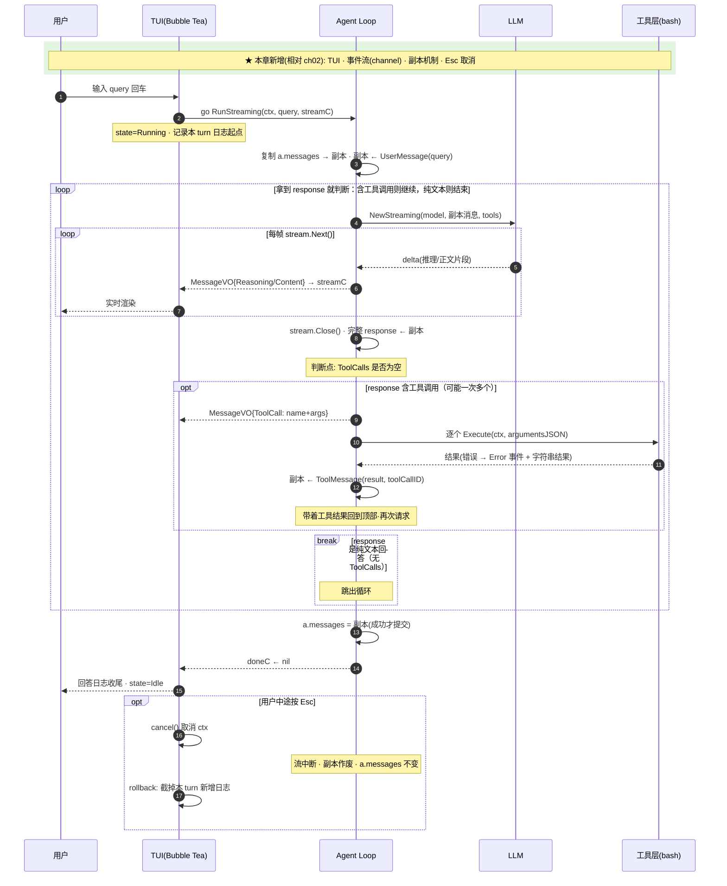

# ch03 · 流式 Agent Loop + TUI

> 读完本章你应能回答：流式 Agent 的模块比 ch02 多了哪几个？Agent 和 UI 之间靠什么解耦？

## 这章解决什么问题

ch02 的 Agent 跑完才返回，看不到过程、也无法中断。本章把循环改成**流式**（模型边生成边输出，含推理过程），并加上**终端 UI**：实时渲染、Esc 随时取消。

## 模块清单

| 模块 | 职责 | 对外形态 |
|------|------|---------|
| LLM 流式调用 | 逐帧拿增量（正文 + 推理） | 迭代器：每帧一个 delta |
| Agent Loop | 快照-副本机制驱动工具循环 | RunStreaming(query, 事件出口) |
| 工具层 | 统一契约（同 ch02） | 本章只带 bash |
| 事件流 | 把过程翻译成 UI 可渲染的事件 | reasoning / content / tool / error |
| TUI | 交互与渲染 | 消费事件 channel；Esc 取消 |

## 一图看懂：时序图（参与者 = 模块，箭头 = 方法调用，自上而下 = 时间）

本章相对 ch02 的新增模块是**事件流**与 **TUI**，二者通过 channel 解耦。

## 关键设计取舍

- **Agent 与 UI 只靠 channel + 事件对象解耦**：事件类型是 UI 无关的，换 Web 前端只需换消费端（ch10 验证了这一点）。
- **本轮消息先写副本，成功才提交回历史**：中断/失败不会留下半截输出污染上下文。
- 显式关闭流连接：循环里每轮重建流，靠 defer 会泄漏。

## 演进

ch04 引入 MCP：让 Agent 能使用外部进程/服务提供的工具，而不只靠自己包里的工具。
