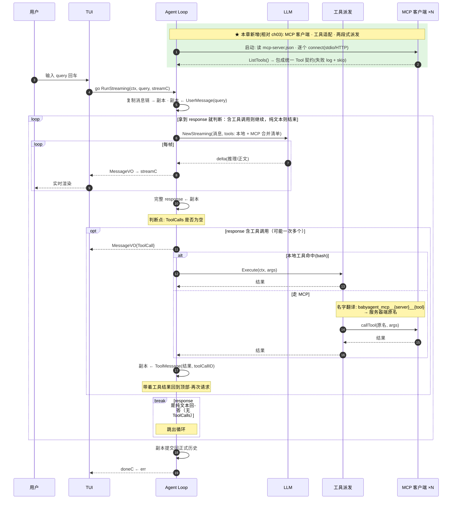

# ch04 · MCP：接入外部工具源

> 读完本章你应能回答：外部工具怎么变成 Agent 可用的工具？多个工具来源怎么统一？

## 这章解决什么问题

ch02-ch03 的工具全是自己包里写的。现实里大量工具由外部进程/服务提供（MCP 服务器）。本章引入 **MCP 客户端**：连接这些服务器，把它们的工具翻译成统一的 Tool 契约，Agent 无感知地混用本地与外部工具。

## 模块清单

| 模块 | 职责 | 对外形态 |
|------|------|---------|
| LLM 流式调用 | 同 ch03 | 迭代器 |
| Agent Loop | 同 ch03（快照-副本） | RunStreaming |
| 本地工具层 | 统一契约（同 ch02） | bash |
| MCP 客户端 | 连接外部服务器，拉取工具清单 | 每个服务器一个客户端 |
| 工具适配 | 把外部工具包成统一 Tool 契约 | 与本地工具同形 |
| 事件流 / TUI | 同 ch03 | channel 解耦 |

## 一图看懂：时序图（参与者 = 模块，箭头 = 方法调用，自上而下 = 时间）

新增模块是 **MCP 客户端 + 工具适配**；Agent 侧只是工具派发多了一条路。

## 关键设计取舍

- **命名映射**：模型看到的工具名带 `服务器名` 前缀（防多个服务器重名），调用时翻译回服务器端原名——「给模型看的名字」和「给服务器看的名字」是两套。
- **服务器失败只跳过不退出**：某个 MCP 服务器挂了，Agent 带着剩下的工具照常工作。
- 两种连接方式：本地进程（stdio）与远程服务（HTTP），对上层透明。

## 演进

ch05 开始处理上下文：消息链无限增长会爆窗口，引入上下文引擎与压缩策略。
