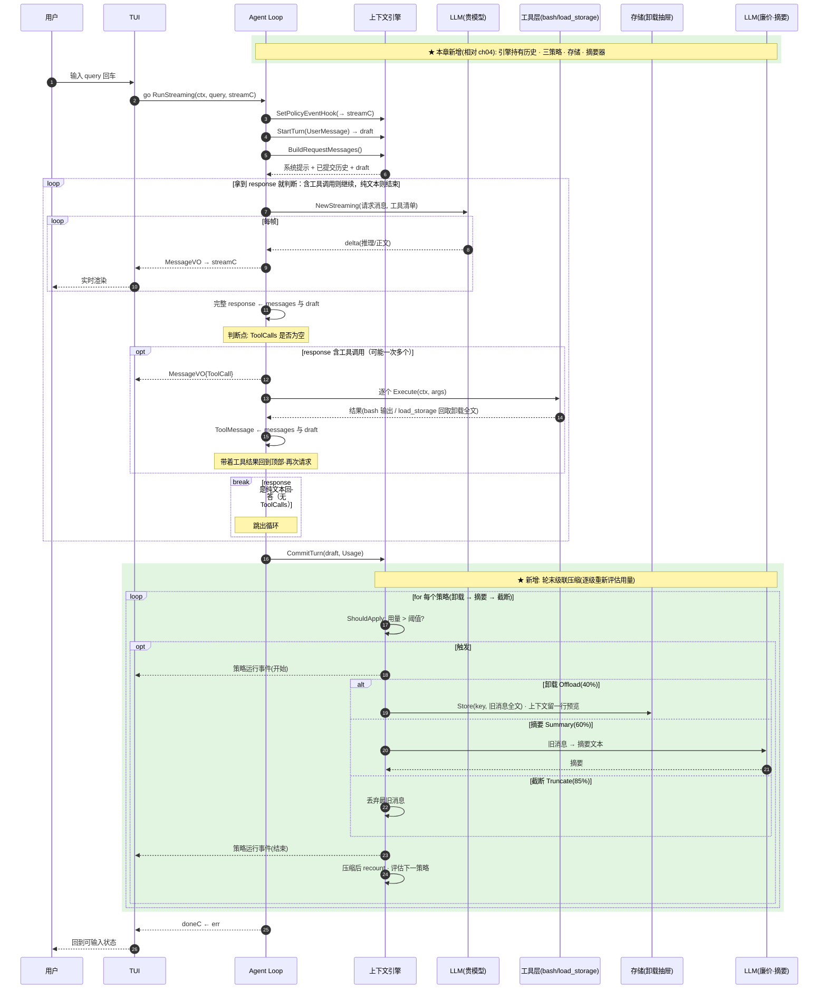

# ch05 · 上下文工程：给消息链装刹车

> 读完本章你应能回答：上下文什么时候压缩、按什么顺序压缩？为什么卸载的内容不自动还原？

## 这章解决什么问题

Agent 跑得越久消息链越长，最终爆掉模型窗口。本章把「历史的持有权」从 Agent 手里拿出来，交给**上下文引擎**：它负责数 token、在轮次结束时按策略级联压缩。

## 模块清单

| 模块 | 职责 | 对外形态 |
|------|------|---------|
| LLM 流式调用 | 同 ch03 | 迭代器 |
| Agent Loop | 同 ch03，但历史改由引擎管 | RunStreaming |
| **上下文引擎**（新） | 持有历史 + token 计数 + 触发策略 | 轮开始拿请求消息；轮结束提交本轮 |
| **压缩策略**（新） | 三个可组合的策略 | 见下 |
| **存储**（新） | 卸载内容的抽屉 | 存 / 取全文 |
| **摘要器**（新） | 用廉价模型把旧消息压成一段摘要 | 消息列表 → 摘要文本 |
| 工具层 | bash + 新增 load_storage | 模型按需取回卸载内容 |
| 事件流 / TUI | 同 ch03，新增策略运行事件 | channel 解耦 |

三个压缩策略（按触发顺序）：

| 策略 | 阈值 | 做什么 |
|------|------|--------|
| 卸载 Offload | 40% | 旧消息全文挪进存储，留一行预览 |
| 摘要 Summary | 60% | 旧消息换成一段摘要 |
| 截断 Truncate | 85% | 直接丢最旧的消息 |

## 一图看懂：时序图（参与者 = 模块，箭头 = 方法调用，自上而下 = 时间）

读这张图 = 写代码的骨架：每个参与者就是一个你要实现的模块，每条箭头就是一个方法签名，`loop`/`opt` 块就是控制流。上下文引擎只有三个对外动作：开草稿、给消息、提交草稿——Agent 从此不直接碰历史。

## 关键设计取舍

- **卸载不自动还原**：预览里留线索，模型需要时自己调 load_storage 取回。窗口保持小，但信息可恢复——这是「按需召回」而非「自动恢复」。
- **策略是纯函数、可组合**：换策略顺序、增删策略都不动引擎。
- 用 token 阈值而非条数触发，贴近真实瓶颈；计数是近似（只算文本）。
- 前端/后端模型分工：贵模型跑对话，廉价模型跑摘要。

## 演进

ch06 在压缩之上加「记忆」：跨会话持久、由 LLM 自己提炼的知识。
