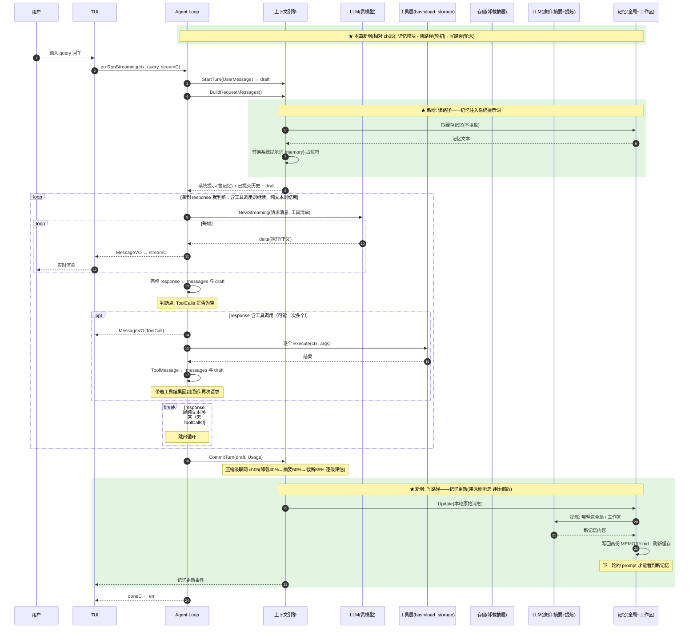

# ch06 · 长期记忆：跨会话的知识

> 读完本章你应能回答：记忆和上下文压缩有什么本质区别？记忆什么时候读、什么时候写？

## 这章解决什么问题

ch05 的压缩只保住「不爆窗口」，但知识随会话结束就丢了。本章加**长期记忆**：每轮结束后由 LLM 自己把值得记住的东西提炼进持久文件，下一会话自动加载。

## 模块清单

| 模块                    | 职责                 | 对外形态                   |
| --------------------- | ------------------ | ---------------------- |
| LLM 流式调用 / Agent Loop | 同 ch05             | —                      |
| 上下文引擎                 | 同 ch05，提交时顺带触发记忆更新 | —                      |
| 压缩策略                  | 同 ch05（不变）         | —                      |
| **记忆**（新）             | 两层：全局 + 工作区        | 每层一个 MEMORY.md 文件      |
| **记忆更新器**（新）          | 用廉价模型从本轮对话提炼新记忆    | 本轮消息 → 新记忆内容           |
| 记忆注入                  | 把记忆塞进系统提示词         | prompt 里的 {memory} 占位符 |
| 工具层 / 事件流 / TUI       | 同 ch05，新增记忆更新事件    | —                      |

两层记忆：**全局**（`~/.babyagent/`，跨项目通用偏好）与**工作区**（`<项目>/.babyagent/`，项目特定知识）。

## 一图看懂：时序图（参与者 = 模块，箭头 = 方法调用，自上而下 = 时间）

## 关键设计取舍

- **记忆 ≠ 压缩**：压缩是「把上下文变小」的机制内操作；记忆是「沉淀跨会话知识」的机制外操作。二者都挂在轮结束，但互不干涉。
- **读在轮初、写在轮末**：本轮看不到自己的记忆更新，下一轮才生效——避免自我引用。
- **用未经压缩的原始消息更新记忆**：压缩是为了塞进窗口，记忆要的是不失真的素材。
- **两层分离**：换项目时工作区记忆跟着走，全局记忆始终带。

## 演进

ch08（ch07 是独立的 RAG 库章节）给 bash 加 Docker 沙箱隔离与执行确认。
