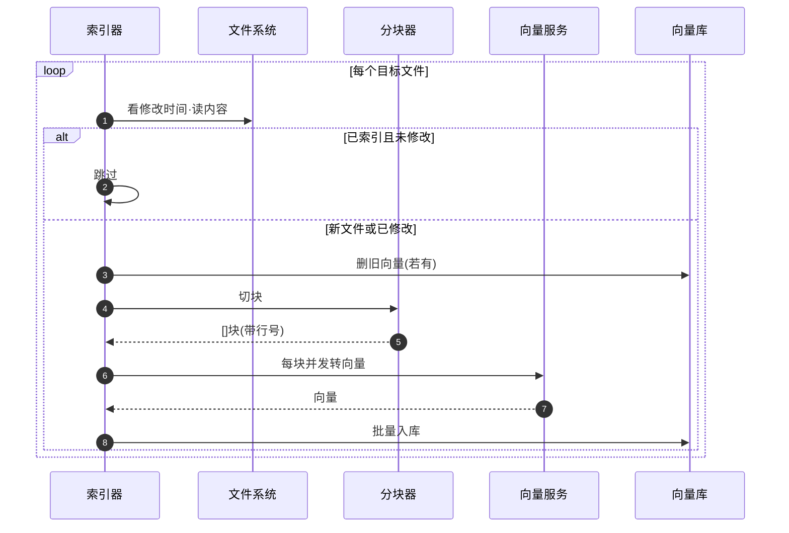
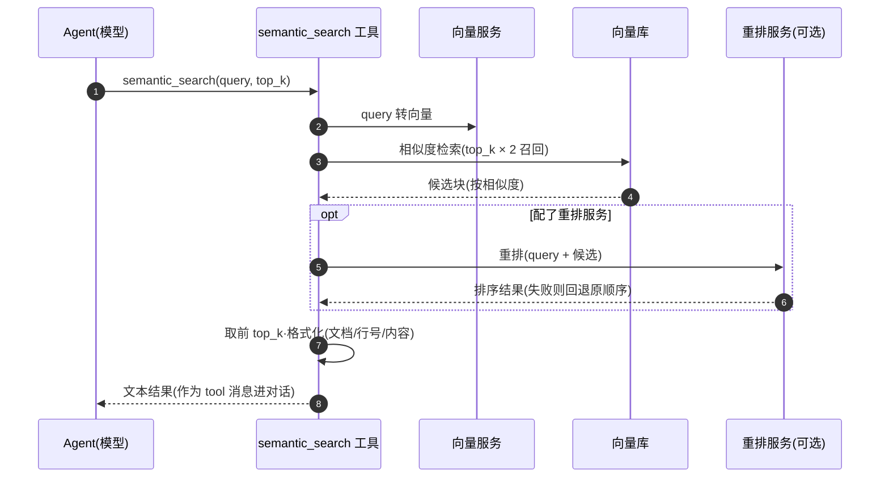

# ch07 · RAG：给 Agent 装知识库

> 读完本章你应能回答：离线索引和在线检索各做什么？为什么先多召回再重排？

## 这章解决什么问题

工具能读写文件，但 Agent 没法「理解」一个几千文件的项目。本章建一个 RAG 子系统：把文档切块、转向量、入库；查询时按语义相似度召回，供 Agent 作为工具调用。**本章没有 Agent 本体**——它是一个独立库 + 一个可插拔的工具。

## 模块清单

| 模块 | 职责 | 对外形态 |
|------|------|---------|
| 文件扫描 | 按扩展名找目标文件 | 文件列表 |
| 分块器 | 把文件切成合适大小的块 | 按行 / 按段落两种策略 |
| 向量服务 | 文本 → 向量 | 外部 /embeddings 接口 |
| 向量库 | 存向量 + 相似度检索 | PostgreSQL + pgvector |
| 重排服务 | 对召回结果精排 | 外部 /rerank 接口（可选） |
| 索引器 | 串起上面各模块做离线索引 | 扫描 → 切块 → 向量化 → 入库 |
| 检索工具 | Agent 的查询入口 | semantic_search(query, top_k) |

各模块之间全部走接口（依赖倒置）：换向量库、换分块策略都不动上下游。

## 一图看懂：时序图 ×2（索引离线跑一次，检索是 Agent 运行时调）

> 支线说明：本章是独立子系统，不进 Agent 主线，没有"上一章的骨架"；检索图里的 `A` 就是主线 Agent 的工具派发入口（调用点在主循环的 `opt 工具调用` 块里）。

索引流水线（离线）：

检索流水线（在线）：

## 关键设计取舍

- **2 倍召回再重排**：向量检索粗筛快但糙，重排模型慢但准——先宽后严是标准两段式。
- **重排失败回退原顺序**：可选服务挂了检索照常可用，只是精度降级。
- **增量索引靠时间戳**：文件没改过就跳过；改过先删旧向量再重灌。
- **切块带行号**：召回结果能定位回源文件，模型可以再用 read 工具读上下文。

## 演进

本章是独立子系统，不进 Agent 主线；ch08 回到主线，给 bash 加沙箱隔离。
