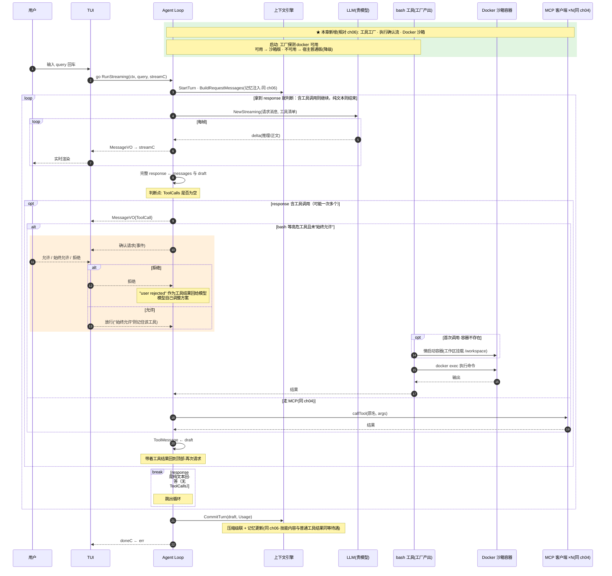

# ch08 · Docker 沙箱：安全的工具执行

> 读完本章你应能回答：为什么 bash 要隔离？容器和工作区怎么共存？危险操作怎么确认？

## 这章解决什么问题

Agent 会跑模型生成的任意 shell 命令，直接在宿主机执行太危险。本章让 bash 跑进 **Docker 容器**（进程、网络、包管理全隔离），同时保持工作区文件互通；另加**执行确认**机制：高危工具先问用户。

## 模块清单

| 模块 | 职责 | 对外形态 |
|------|------|---------|
| LLM / Agent Loop / 上下文引擎 / 记忆 | 同 ch06（不变） | — |
| **工具工厂**（新） | 探测 docker 可用性，决定用哪种 bash | 有 docker → 沙箱版；没有 → 普通版 |
| **沙箱 bash**（新） | 命令在容器里执行 | 对模型仍是同一个 bash 工具 |
| **执行确认**（新） | 高危工具执行前征求用户同意 | 允许 / 拒绝 / 本次会话始终允许 |
| 事件流 / TUI | 同 ch06，新增确认交互 | 确认走独立 channel |

## 一图看懂：时序图（参与者 = 模块，箭头 = 方法调用，自上而下 = 时间）

## 关键设计取舍

- **文件互通、进程隔离**：工作区目录挂载进容器（读写），模型改的文件直接落宿主盘；但跑的进程、装包、网络全在容器里，搞坏了删容器即可。
- **降级而非失败**：docker 不可用就退回普通 bash，Agent 照常工作——沙箱是增强不是硬依赖。
- **模型视角无感**：对模型来说工具始终叫 bash，切换实现它不知道。
- **拒绝也走模型**：用户拒绝后把"user rejected"回传给模型，它会自己调整方案而不是卡死。

## 演进

ch09 引入技能系统：把可复用的操作流程做成文件，模型按需加载。
