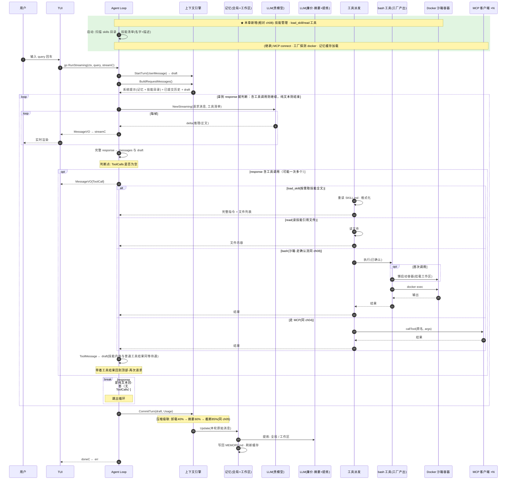

# ch09 · 技能系统：可复用的操作手册

> 读完本章你应能回答：技能是什么？为什么分「目录」和「全文」两层，而不是全部塞进系统提示词？

## 这章解决什么问题

复杂任务（部署、提 PR、写测试）需要长篇操作指南，全塞进系统提示词会永久占用窗口且大部分轮次用不上。本章把指南做成**技能文件**：启动时只注入目录，模型判断需要时再加载全文。

## 模块清单

| 模块 | 职责 | 对外形态 |
|------|------|---------|
| LLM / Agent Loop / 引擎 / 记忆 / 沙箱 / 确认 | 同 ch08（不变） | — |
| **技能管理**（新） | 扫描技能目录，维护技能清单 | 每个技能 = 一个 SKILL.md + 脚本/参考资料 |
| **技能注入**（新） | 只把「名字 + 一句话描述」写进系统提示词 | prompt 里的技能目录 |
| **技能加载工具**（新） | 按需取回某个技能的完整内容 | load_skill(name) |
| **read 工具**（新） | 读技能引用的脚本/参考文件 | read(path) |

一个技能的结构：元数据（名字、描述）+ 主指令（Markdown 正文）+ 可选的 scripts/ 和 references/ 文件。

## 一图看懂：时序图（参与者 = 模块，箭头 = 方法调用，自上而下 = 时间）

> 主线集大成：前八章的所有模块在这张图里全员到齐。拿这张图就可以直接生成一个完整 Agent。

## 关键设计取舍

- **两层设计是空间换时机**：目录常驻（几十 token），全文按需（可能几千 token）。不用就一分钱不花。
- **技能全文就是普通工具结果**：和 bash 输出同等待遇——会被压缩策略处理、会进记忆更新，不需要专门机制。
- **每次加载重读磁盘、不缓存**：改技能文件立即生效，代价是多一次 IO。
- 模型自主判断用不用技能，提示词只说「有这些技能，需要就用 load_skill 加载」。

## 演进

ch10 把整套东西搬上 Web：HTTP 服务 + SSE 流式 + 数据库持久化（同时做减法，砍掉引擎/记忆/技能）。
