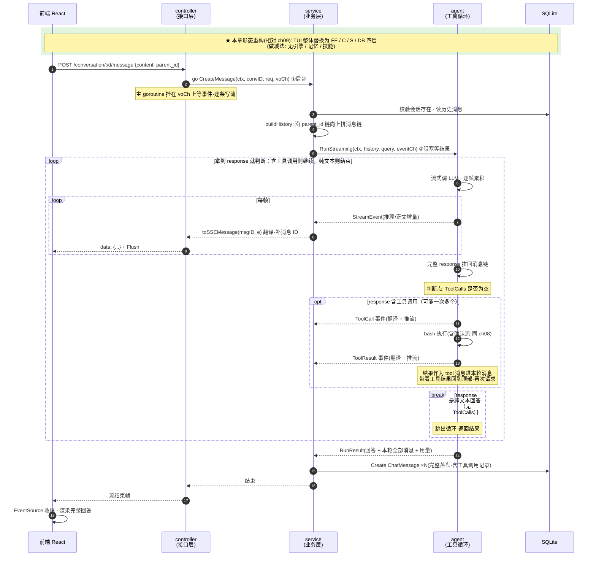

# ch10 · Web 化：HTTP 服务 + SSE

> 读完本章你应能回答：终端 Agent 搬到 Web 需要加哪几层？对话怎么持久化和重建？

## 这章解决什么问题

TUI 只能一个人在终端用。本章把 Agent 包成 **HTTP 服务**：浏览器多端访问、SSE 流式推送、SQLite 持久化对话。同时刻意做减法——砍掉上下文引擎/记忆/技能/沙箱，展示「最小 Web Agent」的骨架。

## 模块清单

| 模块 | 职责 | 对外形态 |
|------|------|---------|
| **HTTP 层**（新） | 路由 + 请求解析 + SSE 推流 | 6 个 REST 端点 |
| **业务层**（新） | 会话管理、历史重建、事件桥接 | controller 只管协议，service 管业务 |
| **Agent** | 精简版工具循环（只有 bash） | 产出「传输无关」的流事件 |
| **持久层**（新） | 会话 + 消息落 SQLite | 树形对话结构 |
| **前端**（新） | React/Vite 单页 | EventSource 消费 SSE |

事件解耦三层：Agent 发「传输无关事件」→ service 翻译成「SSE 消息」（补消息 ID）→ controller 写到 HTTP 流。换协议（WebSocket、gRPC）只动后两层。

## 一图看懂：时序图（参与者 = 分层模块，箭头 = 方法调用，自上而下 = 时间）

读这张图 = 写代码的骨架：controller 只管协议（解析请求、写 SSE 流），service 只管业务（会话、历史、事件翻译），agent 只管工具循环且不知道 HTTP 存在，DB 只管存取。每条箭头就是一个真实的方法调用。

## 关键设计取舍

- **SSE 而非 WebSocket**：只需服务端单向推流，SSE 走普通 HTTP，够用且简单；断连靠 ctx 取消联动终止 Agent。
- **事件三层解耦**：Agent 不知道自己在服务谁；service 不知道协议细节；controller 不知道业务。
- **本轮消息完整落盘**（含工具调用记录）：重建历史就是反序列化存的消息，不需要重放。
- **砍到最小**：没有引擎/记忆/技能——Web 化本身已经引入 5 个新模块，混在一起就看不清了。

## 演进

全课程终点。回顾模块全景：LLM 调用 → 工具循环 → 流式 + UI 解耦 → 外部工具（MCP）→ 上下文工程 → 记忆 → RAG → 沙箱 → 技能 → Web 化——每章一块积木。
